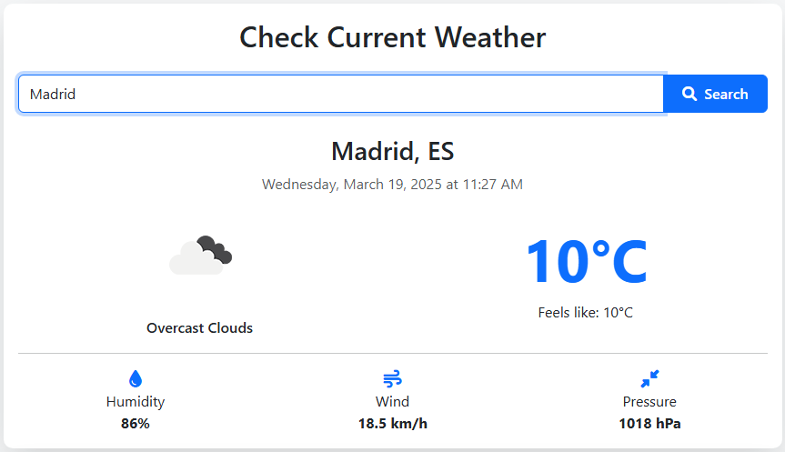
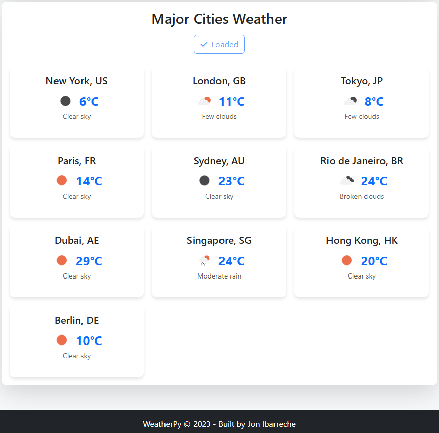

# WeatherPy


A weather application that provides real-time weather information and forecasts for cities around the world using the OpenWeatherMap API.

## Features

- **Current Weather Information**: Get detailed weather data for any city including temperature, humidity, wind speed, and pressure
- **Major World Cities**: View weather conditions for major cities around the world at a glance
- **Responsive Design**: Optimized for both desktop and mobile devices
- **Modern UI**: Clean, intuitive interface with visual weather indicators
- **Error Handling**: Robust error handling for API requests and user inputs

## Screenshots

### Current Weather View


### Major Cities Weather


## Technologies Used

- **Backend**: Python, Flask
- **Frontend**: HTML, CSS, JavaScript, Bootstrap 5
- **APIs**: OpenWeatherMap API
- **Deployment**: Ready for deployment on Heroku

## Requirements

- Python 3.8 or higher
- OpenWeatherMap API Key

## Installation

1. Clone the repository:
```bash
git clone https://github.com/JonIbarreche/WeatherPy.git
cd WeatherPy
```

2. Create and activate a virtual environment:
```bash
python -m venv venv
# On Windows
venv\Scripts\activate
# On macOS/Linux
source venv/bin/activate
```

3. Install dependencies:
```bash
pip install -r requirements.txt
```

4. Create a `.env` file in the root directory and add your OpenWeatherMap API key:
```
OPENWEATHERMAP_API_KEY=your_api_key_here
```

## Usage

1. Start the application:
```bash
python app.py
```

2. Open your browser and navigate to:
```
http://127.0.0.1:5000/
```

3. Enter a city name to get current weather information or click "Load Major Cities" to see weather for global cities

## Deployment

The application includes a `Procfile` for easy deployment to Heroku:

```bash
heroku create weatherpy
git push heroku main
```

## Project Structure

```
WeatherPy/
├── app/                    # Main application package
│   ├── __init__.py         # Flask application factory
│   ├── routes.py           # Application routes and API handlers
│   ├── static/             # Static files
│   │   ├── css/            # CSS stylesheets
│   │   │   └── styles.css  # Main stylesheet
│   │   └── js/             # JavaScript files
│   │       └── app.js      # Main application logic
│   └── templates/          # HTML templates
│       └── index.html      # Main page template
├── src/                    # Source files
│   └── img/                # Images for documentation
│       ├── weather-1.png   # Screenshot of current weather
│       └── weather-2.png   # Screenshot of major cities
├── .env.example            # Example environment variables
├── .gitignore              # Git ignore file
├── app.py                  # Application entry point
├── Procfile                # Heroku deployment configuration
├── README.md               # Project documentation
└── requirements.txt        # Project dependencies
```


## Contributors

- Jon Ibarreche <jon.ibarreche@opendeusto.es>
